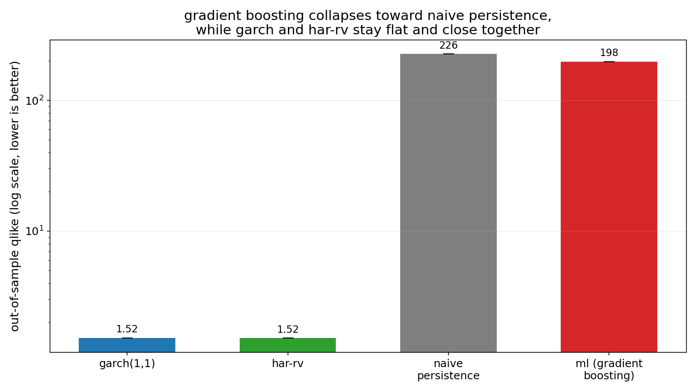

# vol-forecast-garch-vs-ml

> garch(1,1), har-rv, and gradient boosting compared out of sample on daily realized variance, in numpy and scikit-learn

## at a glance

| model | qlike (out of sample) | mse (out of sample) |
|---|---|---|
| garch(1,1) | 1.522779 | 1.648852e-07 |
| har-rv | 1.516278 | 1.603824e-07 |
| naive persistence | 226.250424 | 2.446041e-07 |
| gradient boosting (mean of 5 seeds, std 0.000051) | 197.878866 | 1.817202e-07 |

(`results/baseline.log` lines 10 to 12, `results/run.log` line 14, `results/rigor.log`
line 11.) the claim under test: a gradient-boosted regressor given the identical
daily/weekly/monthly realized-variance feature window as har-rv does not beat har-rv out
of sample. it does not, on both losses.

but the qlike column above is not a fair picture of the size of that gap, and this is the
more interesting result. **one test day out of 4116, 2020-03-13, carries 808186 of the
814469 total qlike, or 99.23 percent of it** (`results/rigor.log` line 22). drop that
single day and gradient boosting scores 1.526779 against har-rv's 1.516339 on the
identical remaining 4115 days (`results/rigor.log` line 25): a loss of well under one
percent, not two orders of magnitude. the honest summary is that gradient boosting on
this feature window is roughly level with har-rv on an ordinary day and catastrophic on
one, and mse, which no single row dominates, agrees: 1.817202e-07 against 1.603824e-07,
about 13 percent worse.

what happens on that day is specific and worth stating plainly, because the obvious
guess is wrong. gradient boosting's raw prediction there is **negative**, -2.173623e-04,
the only negative prediction in the whole test window (`results/rigor.log` line 26).
`src/ml_model.py` clips it to zero, and qlike then floors it at 1.000000e-08, against an actual
of 8.082010e-03, giving a single ratio of roughly 808000. squared-error boosting fits an
additive sum of trees with no non-negativity constraint, so on a right-skewed
non-negative target its score can land below zero. this is not an inability to forecast
large values: gradient boosting's predictions on the test window run up to 6.227674e-03
(`results/rigor.log` line 27), higher than har-rv's or garch's, and it is not an
out-of-range target either, since the training window's realized variance reaches
3.031081e-02 against the test window's maximum of 1.440000e-02, with zero test days above
the training maximum and 11 training days at or above 2020-03-13's actual
(`results/rigor.log` lines 28 to 29).



## how it was measured

four one-day-ahead forecasters for realized variance, scored on the identical
out-of-sample rows:

- **garch(1,1)**, `sigma_t^2 = omega + alpha*r_{t-1}^2 + beta*sigma_{t-1}^2`, fit by
  gaussian quasi-maximum likelihood via `scipy.optimize.minimize` (l-bfgs-b) on the
  training window, then rolled forward through the test window one step at a time.
- **har-rv**, ordinary least squares (closed-form normal equations, no
  `sklearn.linear_model`) regressing next-day realized variance on trailing daily,
  weekly, and monthly realized-variance averages, the standard corsi specification.
- **naive persistence**, tomorrow's forecast is today's realized variance.
- **gradient boosting**, `sklearn.ensemble.GradientBoostingRegressor` (scikit-learn's
  own default hyperparameters, not tuned) trained on the identical daily/weekly/monthly
  feature window har-rv uses, evaluated across 5 fixed seeds (`results/rigor.log` lines 5 to 9), no retraining inside the test window.

data is `data/F-F_Research_Data_Factors_daily.csv`, the fama/french daily factor file
(see `data/README.md`). the daily market return is `Mkt-RF + RF`, converted from
percent to a decimal; realized variance is its square, a squared-daily-return proxy
rather than a true intraday-sampled realized volatility, since no intraday prices are
vendored. all four forecasters are scored on this same proxy.

the split is fixed by date and set before any model was fit: train through `20091231`
(22105 rows), test from `20100104` onward (4147 rows, `results/baseline.log` lines 1 to
3). the split is not touched again after being chosen.

qlike (`actual/pred - log(actual/pred) - 1`) is the headline loss, since it is
scale-free and penalizes under-prediction of variance harder than over-prediction, the
property that matters for a risk forecast. mse is reported alongside as a familiar
cross-check. `src/rigor.py` also prints, for every forecaster, which single day carries
the largest share of its qlike sum and what the average would be without that day, since
a mean over 4116 days says nothing about whether a gap is spread across the window or
sitting in one row.

## caveats

- **the qlike headline is one row.** stated in full above, and repeated here because it
  is the load-bearing caveat: 99.23 percent of gradient boosting's qlike is 2020-03-13.
  qlike divides by the forecast, so any model that can emit a near-zero prediction has an
  effectively unbounded worst case, and the average over 4116 days becomes a report on
  that one day. naive persistence has the same exposure in milder form, 23.12 percent of
  its qlike from 2011-08-18 (`results/rigor.log` line 20). garch and har-rv, whose fitted
  intercepts keep every forecast away from zero, do not: their worst days are 0.60 and
  0.31 percent of their sums (`results/rigor.log` lines 16 and 18). read the mse column,
  or the excluding-2020-03-13 comparison, for the part of the result a single row cannot
  move.
- **the realized-variance target is a squared-daily-return proxy**, not the
  intraday-sampled realized volatility har-rv was designed around. this narrows har-rv's
  usual literature edge over garch(1,1), since both models are working from the same
  coarse daily signal here rather than har-rv getting the richer high-frequency input it
  normally uses.
- **qlike is undefined at exact-zero realized variance.** 31 out-of-sample days have a
  market return that rounds to exactly zero in the vendored file; those rows are
  excluded from every model's qlike average (not from mse), and the excluded count is
  printed in `results/baseline.log` and `results/run.log`.
- **no seed dependence worth reporting.** across 5 fixed seeds, gradient boosting's
  qlike varies by 0.000051 around a mean of 197.878866 (`results/rigor.log` lines 5 to
  11). every seed produces the same negative prediction on the same day, so a different
  random state would not flip this result, and would not fix it either.
- **the garch to har-rv difference is not a finding.** 1.522779 against 1.516278 is a gap
  of 0.4 percent on a single split with no confidence interval around it. nothing here
  supports ranking those two.
- **scale.** this tests one feature set (the har-rv trailing-average window) and one
  series (a broad daily equity market return). it says nothing about whether gradient
  boosting does better with features har-rv does not use (implied volatility, order
  flow, jump components), which is where the literature on ml-vs-har-rv comparisons
  reports most of its gains coming from, or on individual equities rather than a market
  aggregate. it also says nothing about a gradient-boosted model fit on log variance, or
  with a non-negativity constraint, either of which would remove the 2020-03-13 failure.

## reproduce

set up the pinned environment first, since garch's optimizer needs `scipy` alongside
`numpy` and `scikit-learn`. the pins target python 3.13; `scipy==1.15.2` has no wheel for
python 3.14 and will try to build from source there, so name the interpreter rather than
relying on whatever `python3` points at.

```
python3.13 -m venv venv && source venv/bin/activate && pip install -r requirements.txt
```

run the three reference baselines on their own to see garch and har-rv land close
together while naive persistence does not.

```
python src/baseline.py
```

run the full four-way out-of-sample comparison, including the gradient-boosting model,
which is what `results/run.log` was captured from.

```
python src/experiment.py
```

reproduce the 5-seed sweep, the no-lookahead check, and the per-day qlike decomposition
behind the caveats above.

```
python src/rigor.py
```

run the test suite, including the tests that assert the core claim in the direction the
data actually shows it and that pin the 2020-03-13 mechanism.

```
python -m pytest tests/ -v
```

regenerate `results/headline.png` from the committed logs.

```
python src/plot.py
```

every figure quoted above is greppable in a log committed alongside it. the last one or
two significant digits of the optimizer-dependent numbers (garch's `omega`, the ml
model's qlike and mse) move slightly with platform and blas build; the logs here were all
captured on one machine so they agree with each other.
